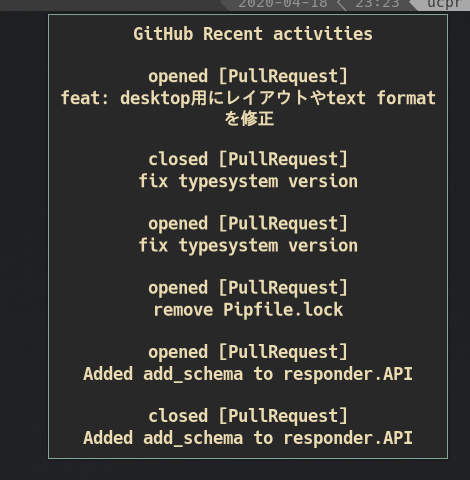

# notifissue
指定したユーザーの直近のissue, pullreqのアクティビティを取得します.  
デスクトップの通知として表示させます.



## Usage
### Install
```
$ go get -u github.com/ucpr/notifissue
```

### requirements
- `notify-send` command

### for notify-send command
add `.bash_profile` or any config file.
```shell
notify-send "`notifissue -u=username`"
```
